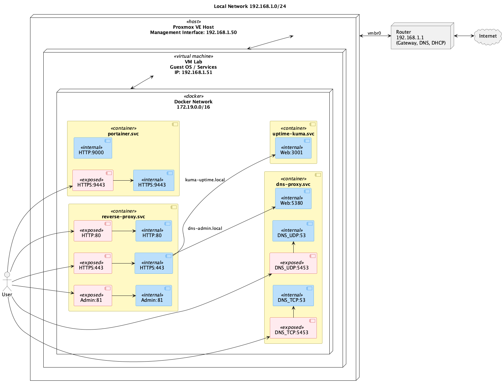
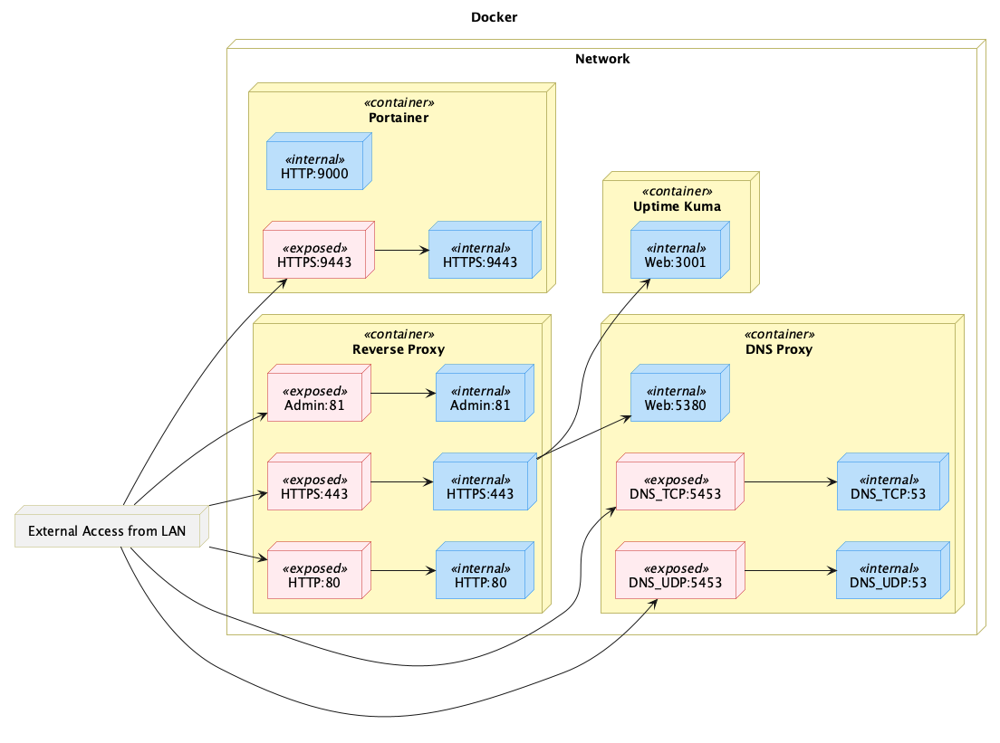

# Home Lab Setup with Portainer and Proxmox VE

In this article we will describe how to set up a Docker environment using [Portainer](https://www.portainer.io/) and [Proxmox VE](https://www.proxmox.com/en/proxmox-ve) for a simple home lab setup.

The main idea is to have a Proxmox VE host running a single VM that hosts the Docker containers. The VM is connected to the local network via a virtual bridge. The Docker containers are managed using Portainer, and a DNS Proxy is used for local domain resolution with domain `.svc` and for external DNS resolution to the Docker containers with domains `.local`. Additionally, Nginx Proxy Manager is used as a reverse proxy to manage external access to the services running in the Docker containers.

> __Note__: This setup is intended for educational purposes and may require adjustments based on your specific hardware and network configuration. 

The golal is to have a Proxmox VE host running with a static IP address on your local network, ready to create virtual machines. Below is a simplified diagram of the setup:




# Setup Overview

The folloiwng setps will be covered in the next sections:
1. Proxmox VE Setup
2. Create Virtual Machine for Docker Containers
3. Docker Compose Setup

## Proxmox VE Setup
Here is a basic overview of the Proxmox VE setup, for a detailed installation guide, please refer to the [Proxmox VE Installation Guide](https://pve.proxmox.com/wiki/Installation) or [Proxmox Beginner’s Guide: Everything You Need to Get Started (YouTube)](https://www.youtube.com/watch?v=lFzWDJcRsqo) by WunderTech.

- Download Proxmox VE from [here](https://www.proxmox.com/en/downloads/category/iso-images-pve) and install it on your server hardware.
- Install from USB
  - set static IP for Proxmox host. Make sure to make DHCP reservations for the Proxmox host IP when your host network uses DHCP to avoid IP conflicts between.
  - After the installation was complete access Proxmox web interface `https://<proxmox-ip>:8006` from your web browser.
  - Next run the [`post-pve-install`](https://community-scripts.github.io/ProxmoxVE/scripts?id=post-pve-install) script to automate post-installation tasks.


## Create Virtual Machine for Docker Containers

Follow these steps to create a virtual machine (VM) in Proxmox VE that will host the Docker containers:
- In this example we will use a fully virtualized machine (VM) to host the Docker containers setup.
- Create a new VM in Proxmox VE with the desired specifications (CPU, RAM, Disk).
- Install a Ubuntu Server on the VM.
    - Download the Ubuntu Server ISO from [here](https://ubuntu.com/download/server) and upload it to Proxmox VE.
    - Mount the ISO to the VM and start the installation process.
    - Follow the installation prompts to set up the OS.

### Install Docker and Docker Compose
  After the installation is complete, log in to the VM and install Docker and Docker Compose.
  Install Docker by following the official Docker installation guide for Ubuntu: [Install Docker Engine on Ubuntu](https://docs.docker.com/engine/install/ubuntu/).

```bash
# Add Docker's official GPG key:
sudo apt update
sudo apt install ca-certificates curl
sudo install -m 0755 -d /etc/apt/keyrings
sudo curl -fsSL https://download.docker.com/linux/ubuntu/gpg -o /etc/apt/keyrings/docker.asc
sudo chmod a+r /etc/apt/keyrings/docker.asc

# Add the repository to Apt sources:
sudo tee /etc/apt/sources.list.d/docker.sources <<EOF
Types: deb
URIs: https://download.docker.com/linux/ubuntu
Suites: $(. /etc/os-release && echo "${UBUNTU_CODENAME:-$VERSION_CODENAME}")
Components: stable
Signed-By: /etc/apt/keyrings/docker.asc
EOF

sudo apt update
```

Install the Docker packages.

```bash
sudo apt install docker-ce docker-ce-cli containerd.io docker-buildx-plugin docker-compose-plugin
```

### Configure DNS Resolver

Insatl dnsm

sudo apt-get install dnsmasq


nameserver 127.0.0.1
nameserver 192.168.1.1
nameserver 8.8.8.8


```bash
sudo systemctl stop systemd-resolved
sudo systemctl disable systemd-resolved
`

sudo unlink /etc/resolv.conf
echo nameserver 8.8.8.8 | sudo tee /etc/resolv.conf


sudo systemctl start dnsmasq
sudo systemctl enable dnsmasq


To use the DNS Proxy later, we need to configure the DNS resolver on the VM to use the DNS Proxy service. Edit the `/etc/systemd/resolved.conf` file and add the following lines:

```
[Resolve]
DNS=127.0.0.1:5354
Domains=~svc ~local
FallbackDNS=192.168.1.1
```

- DNS=127.0.0.1:5354 → Use local DNS server on port 5354.
- Domains=~svc ~local → Send queries for domains `svc` and `local` to the DNS Proxy container with the exposed Docker port 5354.
- FallbackDNS=192.168.1.1 → All other queries go to the local DNS if local DNS can’t resolve them.

Essentially, it’s a split DNS setup: local DNS for internal domains, public DNS for everything else.

After that restart the `systemd-resolved` service to apply the changes:

```bash
sudo systemctl restart systemd-resolved
```

  
### Docker Compose Setup

#### Conatiners
The Docker Compose setup includes the following services:
- Portainer for Docker management.
- Nginx Proxy Manager for managing proxy hosts for example to act as a reverse proxy.
- DNS Proxy for domain resolution of local Docker containers and managing static DNS entries.
- Uptime Kuma for monitoring services

#### Architecture
The setup consists of the following components:
- The DNS Proxy manages DNS entries `*.svc` for all containers and `*.local` for external access. The internal DNS entries are automatically created. External access must be configured manually through the DNS Proxy admin interface.  
- The Reverse Proxy (Nginx Proxy Manager) can be configured to forward external requests (ports 80/443) from `*.local` to the corresponding containers. For example, `uptime-kuma.local` can be forwarded to `uptime-kuma.svc`.



### Reverse Proxy
The reverse proxy service ([Nginx Proxy Manager](https://github.com/jc21/nginx-proxy-manager)
) is configured to manage external access to the Docker containers. It listens on ports 80 and 443 and forwards requests to the appropriate containers based on the configured proxy hosts.


> __Note:__ In our example we did not expose portainer uptime-kuma to the network, instead we use the Nginx Proxy Manager to create a proxy host that forwards requests from `uptime-kuma.local` to `uptime-kuma.svc)`.


### DNS Proxy
The DNS proxy server [(DPS)](https://github.com/mageddo/dns-proxy-server) is configured to resolve specific local domains to designated IP addresses. This is particularly useful for accessing services running in Docker containers using friendly domain names.

> __Note:__ A old version had the problem with Docker 29+ and the container were not added as DNS entries. These seems to be fixed in version 4.0.0.

```yaml
  dns-proxy:
    #image: defreitas/dns-proxy-server:latest
    image: defreitas/dns-proxy-server:4.0.0
    container_name: dns-proxy    
    restart: unless-stopped
    ports:
      - "5380:5380"
      - "5354:53/tcp"
      - "5354:53/udp"
    environment:      
      TZ: "UTC"
      HOSTNAMES: "dns1.svc,dns2.svc" # Optional custom hostnames for the DNS server
      #MG_LOG_LEVEL: "DEBUG"     
      MG_DOMAIN: "svc"
      MG_REGISTER_CONTAINER_NAMES: "true"
    networks:
      - portainer_network
    volumes:
      - /var/run/docker.sock:/var/run/docker.sock
      - ./config/:/app/conf/
```


The option `MG_DOMAIN` and `MG_REGISTER_CONTAINER_NAMES` set to true allows the DNS Proxy to automatically register Docker container names under the specified domain. For example, if you have a container named `web` running, it can be accessed via `web.svc`.

From the host the DNS port can be accessed on port 5354 (both TCP and UDP). You can configure your system or other devices to use this DNS server for resolving local domains.

To set a custom DNS entry in your docker network you can set the environment variable `HOSTNAMES: "foo1.internal, foo2.internal"`.

### Nginx Proxy Manager
Nginx Proxy Manager is set up to manage reverse proxy configurations for your Docker containers. It provides a user-friendly web interface to create and manage proxy hosts, SSL certificates, and other related settings.

Over the Port 81 web interface, you can create proxy hosts that forward requests from external domains (e.g., `my-app.local`) to the corresponding internal Docker containers (e.g., `my-app.svc`).


## DNS
To use the DNS proxy on your local device (MAC, Linux, Windows), you need to set the DNS server to the IP address of your VM IP address. This will allow your device to resolve the local domains managed by the DNS Proxy.

